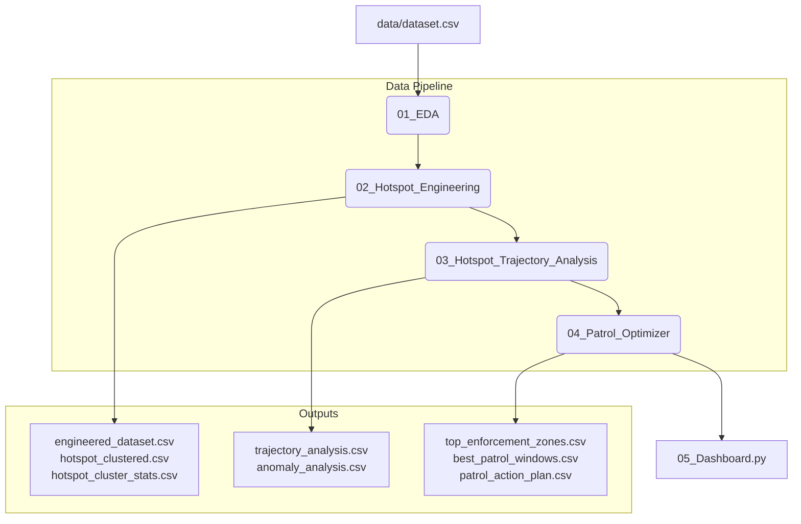

# Parking Violation Analysis & Patrol Optimization System
## Project Documentation

This documentation provides a detailed, simple, and structured overview of the 4 notebooks and the interactive dashboard that make up the Parking Violation Analysis and Patrol Optimization system.

---

## System Overview & Architecture

The system is designed to take raw parking violation data and transform it into actionable intelligence for traffic enforcement. The workflow progresses through four main phases:

---

## 1. Notebook 1: Exploratory Data Analysis (EDA)
**File:** [01_EDA.ipynb](file:///c:/Users/Acer/Desktop/Hackathons/01_EDA.ipynb) (Converted version: [01_EDA.py](file:///c:/Users/Acer/Desktop/Hackathons/01_EDA.py))

### What We Are Trying to Do
Understand the characteristics of the raw violation data, identify data quality issues (missing values, duplicate rows, incorrect GPS coordinates), and filter the dataset specifically for **parking violations**.

### How We Did It
1. **Initial Assessment:** Loaded the raw dataset (`data/dataset.csv`) and checked the count of rows and columns.
2. **Missing & Duplicate Values:** Calculated null percentages for critical fields (timestamps, junction names, vehicle types, validation status) and checked for duplicate rows.
3. **GPS Validation:** Checked the boundaries of latitude and longitude columns to ensure coordinate validity.
4. **Timestamp Parsing:** Converted raw dates/times to pandas datetime objects and extracted temporal attributes (`hour`, `day_of_week`, `month`, `week`, `is_weekend`).
5. **Categorical Distributions:** Analyzed which vehicle types, police stations, and junctions show the highest frequencies of violations.
6. **Parking Subset Filtration:** Filtered the dataset to focus exclusively on parking-related violations (which represents **45.4%** of all logs).
7. **Spatial Density Check:** Grouped coordinates rounded to 3 decimal places to perform a preliminary count of hotspot candidates.

### Key Outputs
* **Data Insights:** Identified that parking-related violations are the dominant category.
* **Refined Focus:** Isolated the parking violation records for downstream modeling.

---

## 2. Notebook 2: Hotspot Engineering & Clustering
**File:** [02_Hotspot_Engineering.ipynb](file:///c:/Users/Acer/Desktop/Hackathons/02_Hotspot_Engineering.ipynb) (Converted version: [02_Hotspot_Engineering.py](file:///c:/Users/Acer/Desktop/Hackathons/02_Hotspot_Engineering.py))

### What We Are Trying to Do
Clean the dataset, design domain-specific risk weighting factors (based on violation severity, vehicle size, and junction impact), cluster coordinates to generate geographic **hotspots**, and rank these hotspots by risk.

### How We Did It
1. **Cleaning:** Filtered records to keep only approved or pending validations.
2. **Severity Weighting:** Mapped violation types to a severity score from `1` (least disruptive, e.g., NO PARKING) to `7` (most disruptive, e.g., PARKING NEAR TRAFFIC LIGHT OR ZEBRA CROSSING).
3. **Vehicle Weighting:** Mapped vehicle categories to weight scores from `1.0` (scooters/mopeds) to `4.0` (Heavy Goods Vehicles) since larger vehicles obstruct traffic more.
4. **Junction Weighting:** Scored junctions dynamically based on historical frequencies (normalized between `0` and `1`).
5. **Spatial Clustering (DBSCAN):** Grouped GPS coordinates into distinct geographic clusters using DBSCAN with `eps=0.00000962` (approx. 10 meters) and `min_samples=20`. This groups dense coordinate areas while discarding isolated incidents as noise.
6. **Priority Scoring:** Computed a composite priority score (`0` to `1`) for each cluster using weighted variables:
   * **Log Violations (45%)**
   * **Average Severity (20%)**
   * **Active Months/Persistence (10%)**
   * **Average Vehicle Weight (10%)**
   * **Average Junction Weight (10%)**
   * **Average Number of Violations Per Event (5%)**
7. **Risk Classification:** Grouped clusters into risk levels based on priority score percentiles:
   * **Low:** 0–50%
   * **Medium:** 50–80%
   * **High:** 80–95%
   * **Critical:** 95–100%

### Key Outputs
* `engineered_dataset.csv`: Intermediate dataset containing computed weights.
* `hotspot_clustered.csv`: Main dataset containing the original data labeled with DBSCAN `cluster_id` numbers.
* `hotspot_cluster_stats.csv`: Aggregated cluster metrics containing coordinates, priority scores, risk levels, and associated police stations.

---

## 3. Notebook 3: Trajectory & Anomaly Analysis
**File:** [03_Hotspot_Trajectory_Analysis.ipynb](file:///c:/Users/Acer/Desktop/Hackathons/03_Hotspot_Trajectory_Analysis.ipynb) (Converted version: [03_Hotspot_Trajectory_Analysis.py](file:///c:/Users/Acer/Desktop/Hackathons/03_Hotspot_Trajectory_Analysis.py))

### What We Are Trying to Do
Understand if violation rates in individual hotspots are getting better or worse over time (trajectory) and identify hotspots experiencing abnormal surges in violation counts during the current month (anomaly detection).

### How We Did It
1. **Monthly Aggregation:** Grouped the cluster statistics by year-month and constructed a pivot table of monthly violation counts.
2. **Trajectory Slopes (Linear Regression):** Fitted a linear regression line over time for each cluster to calculate its slope (trend).
3. **Trajectory Classification:** Evaluated the slope distributions:
   * **Declining:** Slope is at or below the 25th percentile (traffic getting better).
   * **Escalating:** Slope is at or above the 75th percentile (traffic getting worse).
   * **Stable:** Slopes between the 25th and 75th percentiles.
   * **Insufficient History:** Less than 2 active months.
4. **Anomaly Scoring (Z-Score):** Calculated the mean and standard deviation of monthly violations for each hotspot. Compared the latest month (March 2024) to this history:
   $$\text{Z-Score} = \frac{\text{Current Month Count} - \text{Historical Mean}}{\text{Historical Std}}$$
5. **Surge Labeling:** If the latest month's count is $>1.5$ standard deviations above the mean (Z-Score $> 1.5$), it is flagged as an **Abnormal Surge**.

### Key Outputs
* `trajectory_analysis.csv`: Contains the slope, R² (trend reliability), and trajectory labels for each cluster.
* `anomaly_analysis.csv`: Contains the historical statistics, current month counts, Z-scores, and anomaly flags for each cluster.

---

## 4. Notebook 4: Patrol Routing & Optimizer
**File:** [04_Patrol_Optimizer.ipynb](file:///c:/Users/Acer/Desktop/Hackathons/04_Patrol_Optimizer.ipynb) (Converted version: [04_Patrol_Optimizer.py](file:///c:/Users/Acer/Desktop/Hackathons/04_Patrol_Optimizer.py))

### What We Are Trying to Do
Combine risk levels, trends, and current anomalies to calculate an overall operational **patrol priority**. Using this priority, identify the top 20 enforcement zones and optimize their patrol schedules (day of week and hour of day).

### How We Did It
1. **Composite Priority Score:** Combined variables to rank overall urgency:
   * **Priority Norm (50%):** Geographic severity and volume.
   * **Trajectory Weight (30%):** Scales regression slope by R² confidence.
   * **Anomaly Weight (20%):** Z-score intensity of recent surges.
2. **Zone Identification:** Extracted the top 20 hotspots based on the new composite `patrol_priority`.
3. **Temporal Window Profiling:** For these top hotspots, grouped historical violations by day-of-week and hour-of-day.
4. **Shedules Optimization:** Ranked time windows using a combined score: **75% violation counts** and **25% average severity**.
5. **Patrol Recommendations:** Extracted the top 3 high-probability time windows for each zone (e.g., "Monday 09:00-10:00").
6. **Deployment Level Categorization:** Binned hotspots into operational categories:
   * **Routine Monitoring:** Score $\le 0.4$
   * **Targeted Patrol:** Score $0.4 - 0.7$
   * **Immediate Enforcement:** Score $> 0.7$

### Key Outputs
* `top_enforcement_zones.csv`: The top 20 prioritized hotspot locations.
* `best_patrol_windows_detailed.csv`: Hour-by-hour probability profiles for active zones.
* `best_patrol_windows.csv`: Summary of the top 3 recommended patrol windows per cluster.
* `patrol_action_plan.csv`: Operational roster matching stations to clusters, priority scores, deployment levels, and recommended windows.

---

## 5. Streamlit Dashboard
**File:** [05_Dashboard.py](file:///c:/Users/Acer/Desktop/Hackathons/05_Dashboard.py)

### What We Are Trying to Do
Present the analytical findings in an interactive, user-friendly control room application for traffic supervisors.

### Key Tabs & How They Work
* **KPI Overview:** Highlights high-level indicators like total active hotspots, count of Critical hotspots, average violation severity, and zones needing patrol.
* **Risk Zones:** Displays an interactive map (Mapbox scatter plot) of hotspot centroids. Centroids are sized by violation counts and colored by risk level, paired with a leaderboard.
* **Temporal Patterns:** Renders a time-series chart showing historical violation trends and a weekday-vs-hour heatmap showing optimal enforcement times.
* **Patrol Plan:** Renders the operational patrol roster. Users can filter by police station to see which hotspots under their jurisdiction require "Immediate Enforcement" and the recommended patrol hours.
* **Watchlist & Anomalies:** Isolates the active zones experiencing "Abnormal Surges" this month, sorting them by Z-score.
* **Impact Simulator:** Allows supervisors to simulate how enforcement decreases violations.
  * *Methodology:* Users slide a percentage (0% to 50%) to model reduction in violations.
  * *Anchor Normalization:* The system scales down violations, recalculates priority scores, and classifies new risk categories. Crucially, the simulator references the **original baseline quantiles** so that reductions are absolute and do not cause "quantile dilution" (where lower numbers are pushed back up into critical levels).

---

## Data Pipelines Summary File Map

Below is a reference map of files involved and how data flows through them:

| File Name | Purpose | Format | Generated By |
| :--- | :--- | :--- | :--- |
| `data/dataset.csv` | Raw traffic violation log | CSV | Inputs (Raw) |
| `01_EDA.ipynb` | Initial exploration and filtering | Notebook | Pipeline Step 1 |
| `02_Hotspot_Engineering.ipynb` | Weights engineering and DBSCAN clustering | Notebook | Pipeline Step 2 |
| `hotspot_clustered.csv` | Original rows with DBSCAN cluster IDs | CSV | `02_Hotspot_Engineering.py` |
| `hotspot_cluster_stats.csv` | Extracted hotspot attributes & base priority scores | CSV | `02_Hotspot_Engineering.py` |
| `03_Hotspot_Trajectory_Analysis.ipynb` | Trend fitting and current month anomaly Z-scores | Notebook | Pipeline Step 3 |
| `trajectory_analysis.csv` | Trajectory regression slopes and labels | CSV | `03_Hotspot_Trajectory_Analysis.py` |
| `anomaly_analysis.csv` | Historical means, latest counts, and surge flags | CSV | `03_Hotspot_Trajectory_Analysis.py` |
| `04_Patrol_Optimizer.ipynb` | Combined patrol priority & scheduling engine | Notebook | Pipeline Step 4 |
| `patrol_action_plan.csv` | Actionable deploy roster with windows and levels | CSV | `04_Patrol_Optimizer.py` |
| `05_Dashboard.py` | Command-center dashboard interface | Streamlit app | Visualization |
